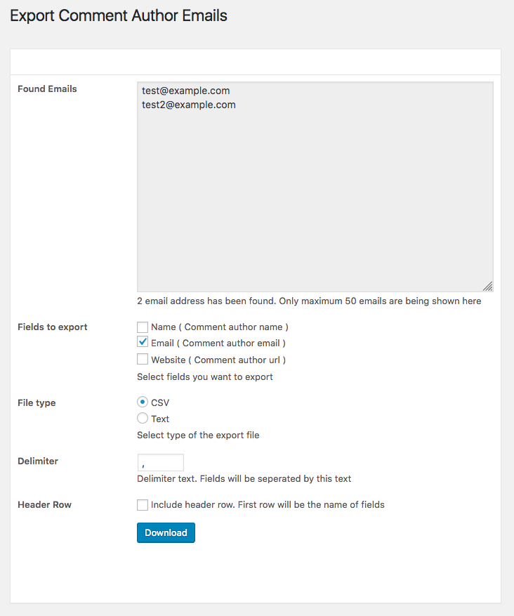

# Export Comment Author Emails
WordPress plugin to export email list from existing comments

Using **Export Comment Author Emails** plugin you can create and export email list from existing comments on your website. Export comment author's name, email address and website url in CSV or plain text format. Some comments are marked as spam. This plugin will not take email address from spam comments.

 

## Download 
[Download from WordPress.org](https://wordpress.org/plugins/export-comment-author-emails/)

